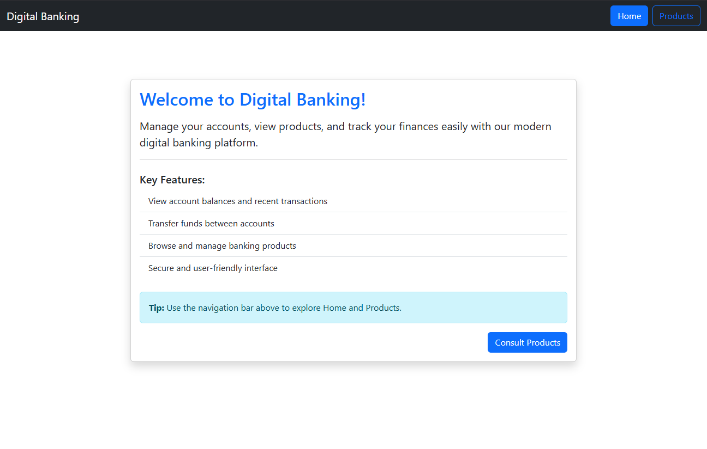

# 💻 Digital Banking App – Angular Frontend

Ce dépôt contient une application frontend simple réalisée avec **Angular**, conçue pour interagir avec un backend Spring Boot dans le cadre d’une activité pratique. Elle met en œuvre une interface basique pour la **gestion des produits**.Cette activité est inspirée de la dernière séance de cours et des vidéos fournies comme ressources.Ce TP fait partie du cours de Java JEE dirigé par Mr YOUSSFI Mohamed.


## 🎯 Objectif

Développer une application web simple permettant :

- L'affichage d'une page d’accueil.
- La visualisation dynamique d’une liste de produits fournie par une API REST Spring Boot.

## 🧱 Structure de l’application

### 🔹 Frontend Angular

- **Home** : Page d’accueil avec un contenu statique.
- **Products** : Page affichant une liste de produits récupérés depuis le backend via `HttpClient`.
- **Routing** : Navigation simple entre `/home` et `/products`.
- **Service** : Appels REST au backend (`GET /products`).

### 🔹 Backend Spring Boot (à héberger séparément)

- Fournit une API REST pour la liste des produits.
- Exemple d’endpoint : `http://localhost:8181/products`
- Autorise les requêtes CORS pour permettre les appels depuis Angular.


### Captures d'écran

| Home Page | Products Page | Avant Suppression | Après Suppression |
|---|---|---|---|
| ! | [](./screenshots/products.png) | [](./screenshots/beforeDelete.png) | [](./screenshots/afterDelete.png) |


## 🚀 Lancement de l’application

### 1. Lancer le backend

Assurez-vous que le backend est lancé (Spring Boot) sur le port 8080 :

```bash
cd digital-banking-backend
mvn spring-boot:run
